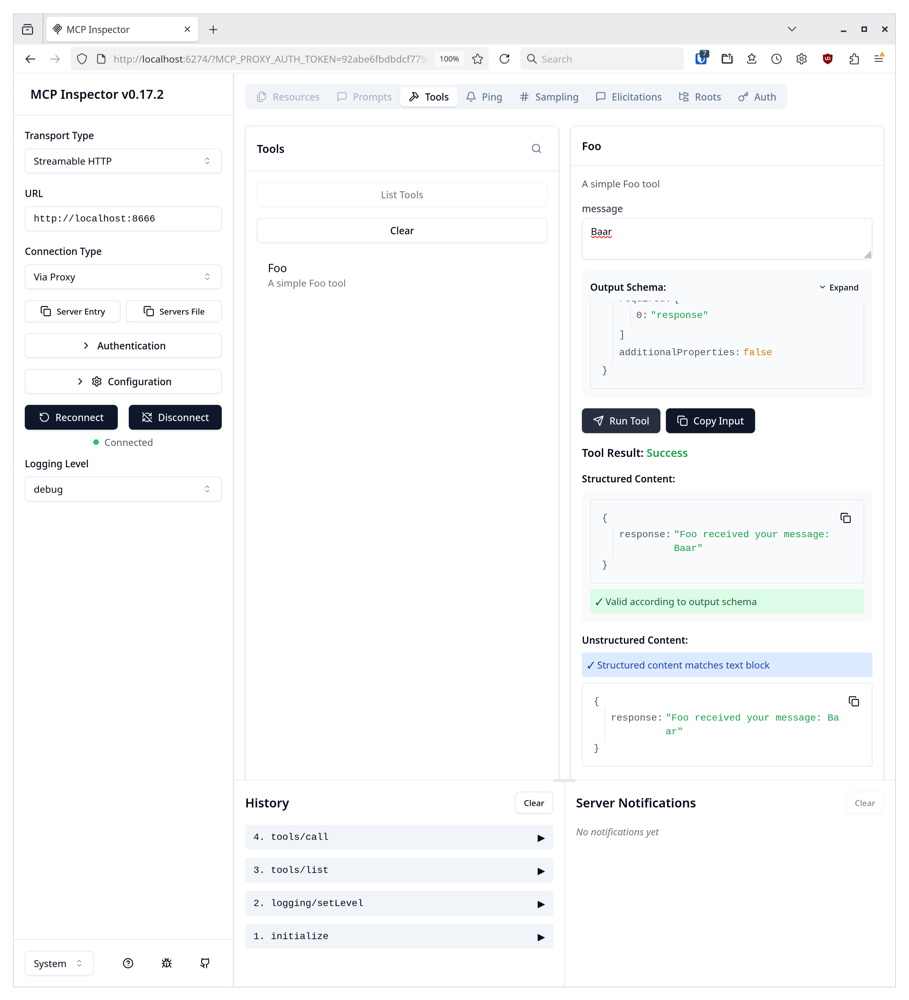

# How to Create an MCP Server

This guide is for developers who want to build an MCP server. It describes how to implement an MCP for listing and adding users.

## What Is an MCP Server?

An MCP server is a wrapper that sits between a Large Language Model (LLM) and an application, wrapping calls from the LLM to the application in JSON.
You might be tempted to wrap your application's existing APIs via [fastapi and fastmcp](https://fastmcp.wiki/en/integrations/fastapi), but as described by [mostly harmless](https://www.jlowin.dev/blog/stop-converting-rest-apis-to-mcp), this is a bad idea.

The main reason for this is that an LLM performs text completion based on the "downloaded" internet and can focus on a topic for no more than approximately 100 pages of text. It's hard to fill these pages with chat, and you may have never encountered this limit. This also means that you need a user story or tasks to fill this book, including all possible failures and dead ends. In our example, we will `add a user "tux" to the system`.

The first pages of this imaginary book are already filled by the *system prompt* and the description of the MCP tool and its parameters. This description is provided by the tool's author, so you can be very descriptive when writing the tool descriptions. A few more lines of text won't hurt.

Every tool call has a JSON overlay, so you also want to avoid too many tool calls. Try to minimize the number of tools and combine similar operations into a single tool. For example, if you had a tool interacting with [systemd](https://github.com/openSUSE/systemd-mcp), you would have just one tool that combines enabling, disabling, starting, and restarting the service, rather than one tool for each operation.

For the tool output, don't hesitate to combine as much information as possible. A good tool's output shouldn't just return the group ID (GID) but also the group name.

The caveat here is that you can easily oversaturate the LLM with too much information, such as returning the output of `find /`. This would completely fill the imaginary book of the LLM conversation. In such cases, trim the information and provide parameters for tools, like filtering the output.

This boils down to the following points:
* Have a user story for the tools.
* Provide extensive descriptions for tools and their parameters.
* Condense tools into sensible operations and don't hesitate to add many parameters.
* A tool call can have several API calls.
* Avoid overload: LLMs can't ignore output, so you are responsible for trimming information.
And also the following bonus point, which I learned along the way:
* Avoid a `verbose` parameter; an LLM will always use it.

== Always remember: ==

== "Context is King" ==

## Build a Sample MCP Server
### User Story

First, we have to come up with a user story. We have to decide what the user should be capable of doing with the tool.

Our user story is quite simple: "I want to add a user to the system."

### First Step

We will use Go for this project and start with this simple boilerplate code, which adds the tool "Foo":

```
package main

import (
	"context"
	"flag"
	"log/slog"
	"net/http"

	"github.com/modelcontextprotocol/go-sdk/mcp"
)

// Input struct for the Foo tool.
type FooInput struct {
	Message string `json:"message,omitempty" jsonschema:"a message for the Foo tool"`
}

// Output struct for the Foo tool.
type FooOutput struct {
	Response string `json:"response" jsonschema:"the response from the Foo tool"`
}

// Foo function implements the Foo tool.
func Foo(ctx context.Context, req *mcp.CallToolRequest, input FooInput) (
	*mcp.CallToolResult, FooOutput, error,
) {
	slog.Info("Foo tool called", "message", input.Message)
	return nil, FooOutput{Response: "Foo received your message: " + input.Message}, nil
}

func main() {
	listenAddr := flag.String("http", "", "address for http transport, defaults to stdio")
	flag.Parse()

	server := mcp.NewServer(&mcp.Implementation{Name: "useradd", Version: "v0.0.1"}, nil)
	mcp.AddTool(server, &mcp.Tool{
		Name:        "Foo",
		Description: "A simple Foo tool",
	}, Foo)

	if *listenAddr == "" {
		// Run the server on the stdio transport.
		if err := server.Run(context.Background(), &mcp.StdioTransport{}); err != nil {
			slog.Error("Server failed", "error", err)
		}
	} else {
		// Create a streamable HTTP handler.
		handler := mcp.NewStreamableHTTPHandler(func(*http.Request) *mcp.Server {
			return server
		}, nil)

		// Run the server on the HTTP transport.
		slog.Info("Server listening", "address", *listenAddr)
		if err := http.ListenAndServe(*listenAddr, handler); err != nil {
			slog.Error("Server failed", "error", err)
		}
	}
}
```

To run the server, we first have to initialize the Go dependencies with:
```
  go mod init github.com/mslacken/mcp-useradd
  go mod tidy
```
Now the server can be run with the command:
```
  go run main.go -http localhost:8666
```
And we can run a JavaScript-based explorer in an additional terminal via:
```
  npx @modelcontextprotocol/inspector http://localhost:8666 --transport http
```
This gives us the following screen after the 'Foo' tool with the input 'Baar' was called.



Let's break down our Go code. After the `imports`, we immediately have two `structs` that manage the input and output for our tool. Go has a built-in serializer for data structures. The keyword `json:"message,omitempty"` tells the serialization library to use "message" as the variable's name. More important is the second option, "omitempty," which marks this as an optional input parameter; if empty, the variable won't be in the output. The "jsonschema" parameter describes what this parameter does and what input is expected. Although the parameter's type is deduced from the struct, the description is crucial. The method for the tool returns the message by constructing the output struct and returning it.
The methos itself is added to the MCP server instance and also needs to have a name and a description. The description of the tool is also highly important and is the **only** way for the LLM to know hat the tool is doing.
